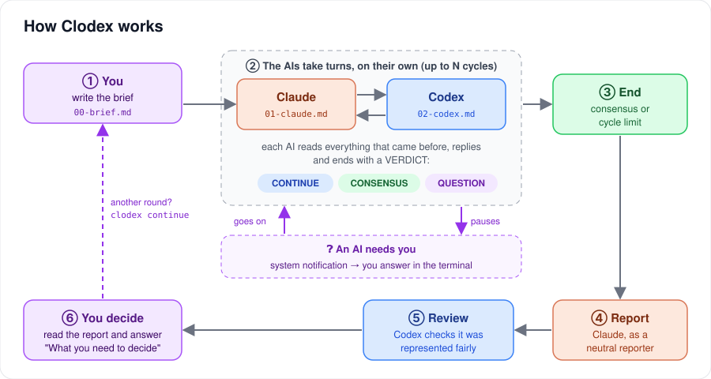
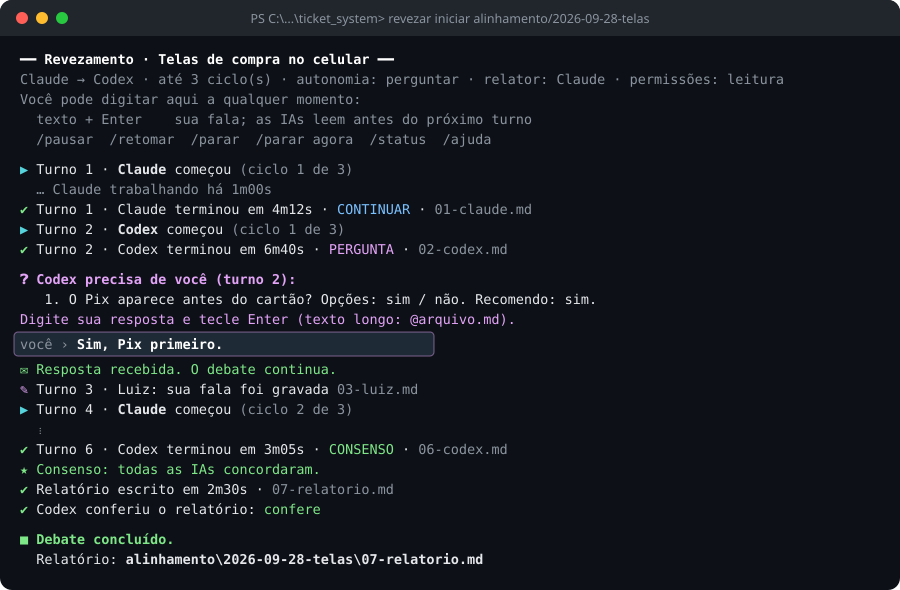

# Clodex · AI interaction

🇧🇷 [Leia em português](README.pt-BR.md)

**Claude Code and Codex debate in turns, on their own, and you get a report.**

Clodex is a command-line orchestrator. You write the brief; Clodex passes the turn from one AI to the other, stops when one of them needs you, and at the end Claude writes the report and Codex reviews it. No more switching windows and pasting one AI's answer into the other.



## In 30 seconds

```bash
# once
cd clodex
npm link
clodex doctor

# in any project
clodex new debates/2026-09-28-checkout --topic "Mobile checkout flow"
#   → write the brief in debates/2026-09-28-checkout/00-brief.md
clodex start debates/2026-09-28-checkout
```

While the debate runs, you type in the same terminal: a sentence becomes your message, and `/pause`, `/resume` and `/stop` control the debate.



## What it does

- **Automatic turn-taking.** Claude → Codex → Claude…, each reading everything that came before. One AI finishing its turn triggers the other's turn.
- **Cycle limit**, configurable (default: 3).
- **Configurable autonomy.** `ask`: the AI stops and consults you. `decide`: they decide and record what they decided for you.
- **Pauses for you.** When an AI asks something, you get a system notification and answer in the terminal.
- **Full control.** Pause, resume, stop at the end of the turn or right away; close the terminal and resume later.
- **Report with review.** A neutral reporter writes what was agreed, the remaining disagreements and "What you need to decide", and the other AI checks it was represented fairly.
- **Any debate language.** The terminal is in English; the debate itself can be in English, Portuguese or any language the AIs speak.
- **Everything in numbered Markdown files** in the debate folder, ready to commit.
- **Safe by default.** Read-only mode, no skipped permissions, no commits. The project's rules (`AGENTS.md`, `CLAUDE.md`) still apply.
- **No dependencies.** Just Node 22+ and the Claude Code and Codex you already use. It even finds them inside the VS Code extensions.

## Documentation

| Document | What for |
|---|---|
| [docs/QUICKSTART.md](docs/QUICKSTART.md) | **Step-by-step guide**, with examples and recipes |
| [docs/MANUAL.md](docs/MANUAL.md) | **Full reference**: protocol, configuration, commands, states, security, limits, extending |
| [examples/](examples/) | Ready-made debates to copy |
| [Português](README.pt-BR.md) | The same documentation in Brazilian Portuguese |

## Requirements

- Node.js 22 or newer
- Claude Code (CLI or VS Code extension), logged in
- Codex (CLI or VS Code extension), logged in
- Tested on Windows 11. macOS and Linux are covered but not tested yet.

## Development

```bash
npm test
```

The tests replace the AIs with a fake agent that imitates Claude's and Codex's output, so they run in seconds and spend no usage. See the [MANUAL, §16](docs/MANUAL.md#16-development-and-tests).
