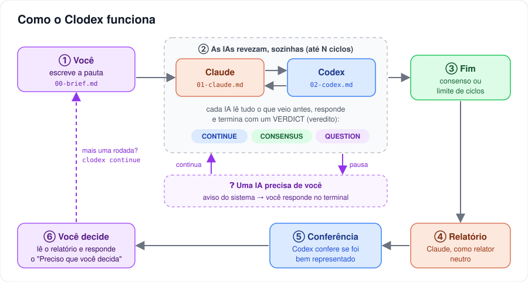

# Clodex · AI interaction

🇺🇸 [Read in English](README.md)

**O Claude Code e o Codex debatem em turnos, sozinhos, e você recebe um relatório.**

O Clodex é um orquestrador de linha de comando. Você escreve a pauta; o Clodex passa a vez de uma IA para a outra, para quando uma delas precisa de você e, no fim, o Claude escreve o relatório e o Codex confere. Chega de trocar de janela e colar a resposta de uma IA na outra.



## Em 30 segundos

```bash
# uma vez só
cd clodex
npm link
clodex doctor

# em qualquer projeto
clodex new debates/2026-09-28-checkout --topic "Fluxo de compra no celular" --language pt-BR
#   → escreva a pauta em debates/2026-09-28-checkout/00-brief.md
clodex start debates/2026-09-28-checkout
```

Durante o debate, você digita no mesmo terminal: uma frase vira sua fala; `/pause`, `/resume` e `/stop` controlam o debate.


> O terminal do Clodex fala inglês. O debate em si (o que as IAs escrevem) segue a configuração `language`, que pode ser `pt-BR`.

## O que ele faz

- **Revezamento automático.** Claude → Codex → Claude…, cada um lendo tudo o que veio antes. O fim do turno de uma IA dispara o turno da outra.
- **Limite de ciclos**, configurável (padrão: 3).
- **Autonomia configurável.** `ask`: a IA para e te consulta. `decide`: elas decidem e registram o que decidiram por você.
- **Pausa para você.** Quando uma IA pergunta, você recebe uma notificação do sistema e responde no terminal.
- **Controle total.** Pausar, retomar, parar ao fim do turno ou na hora; fechar o terminal e retomar depois.
- **Relatório com conferência.** O relator neutro escreve o combinado, as divergências e o "Preciso que você decida", e a outra IA confere se foi bem representada.
- **Debate em qualquer idioma.** O terminal é em inglês; o debate pode ser em português, inglês ou qualquer idioma que as IAs falem.
- **Tudo em arquivos Markdown** numerados, na pasta do debate, prontos para versionar.
- **Seguro por padrão.** Modo só leitura, sem pular permissões, sem commit. As regras do projeto (`AGENTS.md`, `CLAUDE.md`) continuam valendo.
- **Sem dependências.** Só Node 22+ e o Claude Code e o Codex que você já usa. Ele os encontra até dentro das extensões do VS Code.

## Documentação

| Documento | Para quê |
|---|---|
| [docs/pt-BR/INICIO-RAPIDO.md](docs/pt-BR/INICIO-RAPIDO.md) | **Guia passo a passo**, com exemplos e receitas |
| [docs/pt-BR/MANUAL.md](docs/pt-BR/MANUAL.md) | **Referência completa**: protocolo, configuração, comandos, estados, segurança, limites, como estender |
| [examples/](examples/README.pt-BR.md) | Debates prontos para copiar |
| [English](README.md) | A mesma documentação em inglês (versão principal) |

## Requisitos

- Node.js 22 ou mais novo
- Claude Code (CLI ou extensão do VS Code), com login feito
- Codex (CLI ou extensão do VS Code), com login feito
- Testado no Windows 11. macOS e Linux estão previstos, mas ainda não foram testados.

## Desenvolvimento

```bash
npm test
```

Os testes trocam as IAs por um agente falso que imita as saídas do Claude e do Codex, então rodam em segundos e sem gastar uso. Veja o [MANUAL, §16](docs/pt-BR/MANUAL.md#16-desenvolvimento-e-testes).
