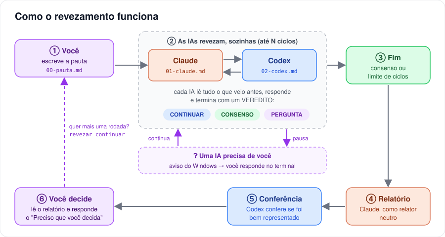

# Como usar: guia rápido

Em 5 minutos você coloca o **Claude** e o **Codex** para debaterem sozinhos. Você escreve o assunto, elas conversam em turnos, e no fim você recebe um relatório com o que ficou combinado e o que precisa da sua decisão.

Você não precisa mais ficar trocando de janela e colando respostas de uma para a outra.



---

## Passo 0 · Instalar (só uma vez)

Abra um terminal (no VS Code: **Terminal → Novo Terminal**) e rode:

```powershell
cd "C:\Users\Luiz\Documents\AUTO AI\revezamento-ia"
npm link
revezar diagnostico
```

Deve aparecer:

```text
✔ Node 22.20.0
✔ Claude: 2.1.283 (Claude Code)
✔ Codex: codex-cli 0.155.0
Tudo pronto.
```

> Não precisa instalar nada além disso. O `revezar` usa o Claude Code e o Codex que já estão no seu computador (ele os encontra dentro das extensões do VS Code), com as mesmas contas e assinaturas.

---

## Passo 1 · Criar o debate

Entre na pasta do projeto e crie o debate:

```powershell
cd "C:\Users\Luiz\Documents\AUTO AI\ticket_system"
revezar novo alinhamento/2026-09-28-telas --tema "Telas de compra no celular"
```

Isso cria uma pasta com dois arquivos:

```text
alinhamento/2026-09-28-telas/
├── revezamento.json   ← as regras do debate (ciclos, autonomia...)
└── 00-pauta.md        ← o que você quer que elas debatam
```

---

## Passo 2 · Escrever a pauta

Abra o `00-pauta.md`, **apague a primeira linha** (o comentário `<!-- revezar:preencha... -->`) e escreva o que quer. Exemplo:

```markdown
# Pauta: Telas de compra no celular

## O que eu quero decidir
Qual a melhor sequência de telas para comprar ingresso no celular:
quantas etapas, o que aparece em cada uma e onde fica o Pix.

## Contexto e arquivos para ler
- `alinhamento/2026-09-27-telas-e-identidade-consolidacao-claude.md`: onde paramos
- `DECISIONS.md`: o que já está decidido

## O que já está decidido (não rediscutir)
- Identidade visual do Claude.
- Um QR por ingresso.

## Como quero a resposta
Uma sequência única de telas, com o motivo de cada escolha.
```

> **Dica:** quanto mais clara a pauta, mais curto e útil o debate. Diga o que **não** é para rediscutir.

---

## Passo 3 · Iniciar

```powershell
revezar iniciar alinhamento/2026-09-28-telas
```

E é só acompanhar. O terminal mostra cada turno começando e terminando:


Cada turno vira um arquivo na pasta, na ordem:

```text
alinhamento/2026-09-28-telas/
├── 00-pauta.md
├── 01-claude.md       ← proposta do Claude
├── 02-codex.md        ← resposta do Codex
├── 03-luiz.md         ← sua resposta a uma pergunta
├── 04-claude.md
├── ...
└── 08-relatorio.md    ← o relatório final
```

> ⏱️ Cada turno leva alguns minutos, porque a IA lê o projeto antes de responder. Um aviso aparece a cada minuto para você saber que ela está trabalhando. Pode deixar rodando e fazer outra coisa: quando precisar de você, **o Windows mostra uma notificação**.

---

## Passo 4 · Participar enquanto roda

Você participa **digitando no mesmo terminal**, a qualquer momento:

| Quero... | Digito no terminal do debate |
|---|---|
| Responder a uma pergunta | a resposta + **Enter** |
| Dar um palpite no meio do debate | o texto + **Enter** (entra antes do próximo turno) |
| Mandar um texto grande | salvo num arquivo e digito `@minha-resposta.md` |
| Pausar | `/pausar` (espera o turno atual terminar) |
| Continuar depois da pausa | `/retomar` |
| Parar | `/parar` (espera o turno atual) ou `/parar agora` |
| Ver em que pé está | `/status` |

**Quando uma IA pergunta**, o debate para e espera por você:

```text
❓ Codex precisa de você (turno 2):
   1. O Pix aparece antes do cartão? Opções: sim / não. Recomendo: sim.

Digite sua resposta e tecle Enter (texto longo: @arquivo.md).
você › Sim, Pix primeiro. Cartão fica como segunda opção.
✉ Resposta recebida. O debate continua.
```

Sua resposta vira um turno (`03-luiz.md`) e as duas IAs a leem.

<details>
<summary><b>Prefere usar outro terminal?</b> (clique para ver)</summary>

Os mesmos comandos funcionam de qualquer terminal, até de outra pasta. O `revezar` lembra do último debate usado:

```powershell
revezar status
revezar responder "Sim, Pix primeiro."
revezar responder @minha-resposta.md
revezar pausar
revezar retomar
revezar parar
revezar parar --agora
```

</details>

---

## Passo 5 · Ler o relatório

Quando as IAs concordam (**consenso**) ou chegam ao limite de ciclos, o **Claude escreve o relatório** como relator neutro, e o **Codex confere** se as posições dele foram bem representadas. O relatório sempre tem estas partes:

| Seção | O que tem |
|---|---|
| **Resultado em uma frase** | a conclusão |
| **O que ficou combinado** | tabela com cada ponto, quem propôs e em qual turno |
| **Divergências que sobraram** | a posição de cada IA e a recomendação |
| **Decisões que as IAs tomaram por você** | só no modo `decidir`, para você conferir |
| **Preciso que você decida** | a lista numerada do que é seu |
| **Próximos passos** | o que fazer depois |
| **Conferência do Codex** | "Confere" ou as correções dele |

---

## Passo 6 · Depois do relatório

- **Concordou com tudo?** Acabou. Os arquivos ficam na pasta como registro.
- **Quer que elas continuem com as suas decisões?** Responda aos itens do "Preciso que você decida" e rode mais uma rodada:

```powershell
revezar continuar --mais 1 --mensagem "1: sim. 2: opção B. 3: deixa para depois."
```

Isso roda **mais 1 ciclo** (cada IA fala mais uma vez) e gera um relatório novo.

---

## Receitas de configuração

Tudo fica no `revezamento.json` da pasta do debate. Mude só o que precisar:

**Quero ser consultado sempre** (padrão)
```json
{ "autonomia": "perguntar" }
```

**Decidam vocês e me tragam o resultado**
```json
{ "autonomia": "decidir" }
```
> Mesmo assim elas param se algo for de segurança, jurídico, dinheiro ou irreversível, e nunca aprovam planos no seu lugar.

**Debate curto** (1 ciclo = cada IA fala uma vez)
```json
{ "max_ciclos": 1 }
```

**O Codex começa**
```json
{ "participantes": ["codex", "claude"] }
```

**Elas precisam criar arquivos** (mockups, exemplos)
```json
{ "permissoes": "escrita" }
```
> Cada IA só consegue gravar na própria pasta `anexos/NN-nome/` dentro do debate. O resto do projeto continua só leitura.

**Sem relatório no fim**
```json
{ "relator": null }
```

**Regras extras para as duas**
```json
{ "instrucoes_extras": "Respostas curtas. Sempre compare com o que a Ingresse faz." }
```

A lista completa está no [MANUAL, §5](MANUAL.md#5-configuração-completa).

---

## Cola rápida

| Comando | Para quê |
|---|---|
| `revezar novo <pasta> --tema "..."` | criar um debate |
| `revezar iniciar [pasta]` | começar, ou continuar de onde parou |
| `revezar status` | ver a situação |
| `revezar responder "..."` | responder ou comentar (aceita `@arquivo.md`) |
| `revezar pausar` / `retomar` | pausar e continuar |
| `revezar parar [--agora]` | parar |
| `revezar continuar --mais 1 --mensagem "..."` | mais uma rodada depois do relatório |
| `revezar relatorio` | gerar o relatório agora, com o que houver |
| `revezar diagnostico` | conferir a instalação |

---

## Problemas comuns

| O que aparece | O que fazer |
|---|---|
| `revezar` não é reconhecido | Rode o Passo 0 de novo (`npm link` na pasta do revezamento-ia). Alternativa: `node "C:\Users\Luiz\Documents\AUTO AI\revezamento-ia\bin\revezar.mjs" ...` |
| `✖ Claude: não encontrado` ou `✖ Codex: não encontrado` | Confira se a extensão está instalada no VS Code. Se estiver em outro lugar, veja o [MANUAL, §12](MANUAL.md#12-onde-o-revezar-procura-o-claude-e-o-codex) |
| "A pauta ainda é o modelo em branco" | Apague a primeira linha do `00-pauta.md` |
| "Já existe um maestro rodando" | Outro terminal está com esse debate aberto. Use `revezar status` ou `revezar parar` |
| "✖ Turno 3 (Codex): ..." e o debate parou | Normalmente é limite de uso ou internet. Espere e digite `/retomar` (ou `revezar retomar`) |
| Fechei o terminal sem querer | Rode `revezar iniciar` de novo: continua do último turno completo |
| O Codex diz "Acesso negado" ou não acha arquivos | Deixe o debate numa pasta comum (Documentos, pasta do projeto), nunca em pastas temporárias do Windows (`AppData\Local\Temp`). Veja o [MANUAL, §14](MANUAL.md#14-solução-de-problemas) |
| Quero ver exatamente o que a IA recebeu | Abra `.revezar/prompts/` dentro da pasta do debate |

Mais detalhes: [MANUAL.md](MANUAL.md).
